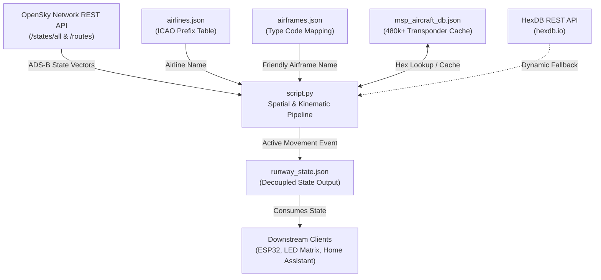

# MSP Runway Traffic Monitor & Telemetry Pipeline

[](https://www.python.org/)
[](https://www.mspairport.com/)
[](https://opensky-network.org/)
[](https://opensource.org/licenses/MIT)

A lightweight, geofenced Python telemetry daemon that monitors real-time flight operations at **Minneapolis–Saint Paul International Airport (KMSP)**. 

The service polls ADS-B state vectors from the OpenSky Network, projects aircraft coordinates onto extended runway centerline vectors, resolves airline and airframe metadata, and continuously exports active takeoff/landing events to a local JSON state interface for downstream hardware displays (such as ESP32 LED matrices, e-ink monitors, or home automation dashboards).

---

## Architecture Overview



---

## Features

- **Real-Time ADS-B Polling:** Queries OpenSky Network for flights within the KMSP terminal airspace bounding box.
- **Runway Vector Projection:** Accurately assigns aircraft to KMSP runways (`12L/30R`, `12R/30L`, `4/22`, `17/35`) using vector projection onto extended runway centerlines.
- **Kinematic Gating:** Eliminates ground taxi traffic, stationary vehicles, and high-altitude overflights via ground speed, altitude, and vertical rate filters.
- **Comprehensive Metadata Resolution:**
  - **Airlines:** Translates 3-letter ICAO callsign prefixes to commercial airline names (e.g., `DAL` &rarr; *Delta Air Lines*, `EDV` &rarr; *Endeavor Air*).
  - **Airframes:** Decodes transponder hex codes to readable aircraft types (e.g., `A21N` &rarr; *Airbus A321neo*, `B738` &rarr; *Boeing 737-800*).
  - **Routes:** Resolves origin airports for arrivals and destination airports for departures.
  - **Dynamic Fallback:** Queries [HexDB](https://hexdb.io) for unseen airframes and caches results locally.
- **Decoupled JSON Interface:** Writes atomic telemetry snapshots to `runway_state.json`, separating data ingestion from display rendering.

---

## File Structure

| File | Purpose |
| :--- | :--- |
| [`script.py`](script.py) | Main telemetry daemon: polling loop, kinematic gating, runway matching, and state export. |
| [`seed_database.py`](seed_database.py) | Utility to download and parse OpenSky's official aircraft metadata database into local JSON cache. |
| [`airlines.json`](airlines.json) | Static mapping of 3-letter ICAO airline designators to commercial operator names. |
| [`airframes.json`](airframes.json) | Static mapping of ICAO aircraft designators to clean, readable names. |
| [`msp_aircraft_db.json`](msp_aircraft_db.json) | Local persistent registry of 480k+ 24-bit ICAO transponder addresses mapped to type codes. |
| [`runway_state.json`](runway_state.json) | Ephemeral output file updated every cycle with the latest detected operation. *(Ignored by git)* |
| [`requirements.txt`](requirements.txt) | Python dependencies. |

---

## Technical Details

### 1. Spatial Runway Matching Algorithm
KMSP's runways are defined as directional vector segments between physical threshold coordinates:
- **12L/30R** (Parallel primary)
- **12R/30L** (Parallel primary)
- **4/22** (Crosswind runway)
- **17/35** (North-South runway)

Coordinates are projected from spherical WGS84 $(lat, lon)$ onto a local Cartesian tangent plane centered on KMSP ($44.88^\circ\text{N}, -93.22^\circ\text{W}$):
$$\Delta X = (lon - lon_{\text{MSP}}) \times 78,740.0\text{ m/deg}$$
$$\Delta Y = (lat - lat_{\text{MSP}}) \times 111,139.0\text{ m/deg}$$

For an aircraft position $P$ and runway threshold endpoints $A$ and $B$, the script computes the scalar projection parameter $t$:
$$t = \frac{\vec{AP} \cdot \vec{AB}}{\|\vec{AB}\|^2}$$

- **Extended Capture Corridor:** $t$ is clamped to $[-1.5, 2.5]$, extending the detection corridor past physical runway thresholds to capture arrival funnels and initial departures.
- **Cross-Track Tolerance:** Aircraft must be within **$150\text{ meters}$** lateral orthogonal distance of the extended centerline.
- **Heading Alignment:** Aircraft true track must match runway magnetic orientation within **$\pm 25^\circ$**.

### 2. Kinematic Gating
- **Ground Speed Threshold:** Velocity must exceed $35.0\text{ m/s}$ ($\approx 68\text{ knots}$) to filter out ground tugs, stationary tarmac transponders, and slow taxi traffic.
- **Altitude Ceiling:** Barometric altitude must remain below $1,200\text{ m}$ ($\approx 3,937\text{ ft MSL}$) to filter en-route traffic.
- **Vertical Rate Gate:**
  - $\text{vertical\_rate} > +1.5\text{ m/s} \implies \text{TAKING OFF}$
  - $\text{vertical\_rate} < -1.5\text{ m/s} \implies \text{LANDING}$
  - Level transit ($\pm 1.5\text{ m/s}$) is dropped.

---

## State Output Schema

The daemon continuously outputs the latest event to `runway_state.json`:

```json
{
  "active_runway": "30L",
  "action": "LANDING",
  "callsign": "Delta Air Lines 793",
  "aircraft_type": "Boeing 737-900",
  "route": "From KDEN",
  "timestamp": 1727820300
}
```

When no active operations match the corridor filters:
```json
{
  "active_runway": "NONE",
  "action": "IDLE",
  "callsign": "",
  "aircraft_type": "NONE",
  "route": "NONE",
  "timestamp": 1727820330
}
```

---

## Getting Started

### Prerequisites
- Python 3.10 or higher
- Git

### Installation

1. **Clone the repository:**
   ```bash
   git clone https://github.com/kenne839/MSP-Runway-Tracker.git
   cd MSP-Runway-Tracker
   ```

2. **Install dependencies:**
   ```bash
   pip install -r requirements.txt
   ```

3. **(Optional) Seed / Refresh Aircraft Database:**
   The repository already includes `msp_aircraft_db.json`. To refresh it with the latest global database (~35MB download from OpenSky):
   ```bash
   python seed_database.py
   ```

4. **Run the tracker:**
   ```bash
   python script.py
   ```

---

## Operational Notes & Considerations

- **OpenSky Route Availability:** Mode S ADS-B Out broadcasts kinematics, transponder squawk, and callsign, but **not** flight plans or route itineraries. OpenSky infers flight plans via crowdsourced schedules. Regional carriers (e.g., SkyWest / Endeavor operating under Delta Connection) frequently rotate flight numbers, so route lookups may occasionally display `"Unknown"`.
- **Polling Intervals:** By default, the script polls every 30 seconds. Unauthenticated OpenSky endpoints are rate-limited per IP. If using an authenticated account or local ADS-B feeder (e.g., dump1090/readsb), you can lower this interval for near-instant updates.
- **Crosswind Crab Angles:** In heavy winter crosswinds, aircraft track over ground can deviate by $10^\circ\text{--}20^\circ$ from heading due to wind correction angles. The current heading tolerance is set to $\pm 25^\circ$ to accommodate crab angles.

---

## License

This project is licensed under the [MIT License](LICENSE).
