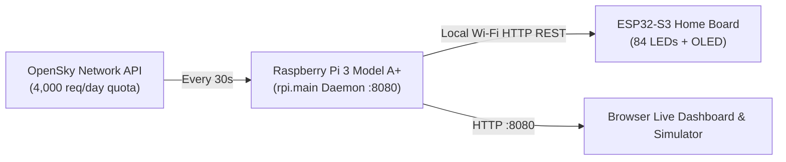
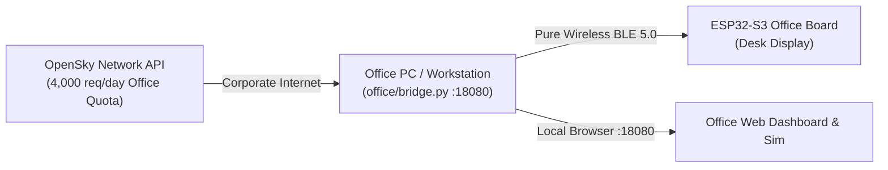

# MSP Runway Traffic Monitor & Telemetry Pipeline

[](https://www.python.org/)
[](https://www.mspairport.com/)
[](https://opensky-network.org/)
[](https://opensource.org/licenses/MIT)

A lightweight, geofenced Python telemetry daemon that monitors real-time flight operations at **Minneapolis–Saint Paul International Airport (KMSP)**. 

The service polls ADS-B state vectors from the OpenSky Network, projects aircraft coordinates onto extended runway centerline vectors, resolves airline and airframe metadata, and continuously exports active takeoff/landing events to a local JSON state interface for downstream hardware displays (such as ESP32 LED matrices, e-ink monitors, or home automation dashboards).

---

## Architecture Overview

```mermaid
flowchart TD
    API["OpenSky Network REST API<br/>(/states/all & /routes)"] --> INGEST["Telemetry Ingestion Engine<br/>(Spatial Projection & Kinematic Gating)"]
    
    META["Airlines, Airframes & Transponder DB<br/>(480k+ Aircraft Cache + HexDB Fallback)"] --> INGEST
    
    subgraph HOME["Home Deployment: Board 1"]
        PI["Raspberry Pi 3 Model A+ (512MB RAM)<br/>(Headless rpi.main Daemon)"]
        INGEST --> PI
        PI -->|Wi-Fi HTTP REST /api/runway_state| ESP_HOME["ESP32-S3 Board (env: home_wifi)<br/>84 WS2812B LEDs + Dual-Color OLED"]
        PI -->|Web UI / Simulator| DASH["Browser Dashboard (:8080)"]
    end
    
    subgraph OFFICE["Office Deployment: Board 2"]
        PC["Office PC / Workstation<br/>(office/bridge.py Companion)"]
        INGEST --> PC
        PC -->|Pure Wireless BLE 5.0 (Nordic UART)| ESP_OFFICE["ESP32-S3 Board (env: office_ble)<br/>84 WS2812B LEDs + Dual-Color OLED"]
    end
```

---

## Hardware & Deployment Configurations

The project supports two distinct physical hardware setups:

### 1. Board 1: Home Setup (Wi-Fi + Raspberry Pi 3 Model A+)
- **Microcontroller:** Custom **ESP32-S3-WROOM-1-N16R8** PCB (16MB Flash, 8MB Octal PSRAM) running PlatformIO environment `home_wifi`.
- **Telemetry Server:** Dedicated headless **Raspberry Pi 3 Model A+ (512MB RAM)**:
  - Broadcom BCM2837B0 Quad-Core 64-bit ARM Cortex-A53 @ 1.4 GHz
  - Dual-band 2.4 GHz & 5.0 GHz IEEE 802.11ac Wi-Fi
  - Low memory footprint (~40 MB RAM usage for daemon + 480k aircraft DB)
  - Hosted systemd daemon (`rpi.main`) serving `/api/runway_state` and real-time web dashboard/simulator at port `8080`.
- **Displays:**
  - 84 individually addressable WS2812B runway LEDs (approach and rollout comets).
  - UCTRONICS 0.96" Dual-Color (Yellow/Blue) SSD1306 OLED (Header/Runway/Action on yellow rows 0–15; Callsign, Airline, Airframe, Route on blue rows 16–63).

### 2. Board 2: Office Setup (Wireless BLE 5.0 + PC Companion)
- **Microcontroller:** Custom **ESP32-S3-WROOM-1-N16R8** PCB running PlatformIO environment `office_ble`.
- **PC Companion:** Python bridge script ([`office/bridge.py`](office/README.md)) running locally in the background on your office workstation.
  - No corporate Wi-Fi access, static IP, or router configuration required.
  - Automatically pairs and streams runway telemetry over **Bluetooth Low Energy 5.0** (Nordic UART Service).
  - Completely wireless desktop operation powered by standard 5V USB.
- **Displays:** Same 84 WS2812B LED array and UCTRONICS 0.96" Dual-Color OLED screen.

### Hardware Pinout & Programming
Both boards feature a **3-Pin UART Header `J2`** for external USB-to-UART programmer connection (FTDI / CP2102):
- **Pin 1:** `GND`
- **Pin 2:** `GPIO43` (`TXD0`) &rarr; Programmer RX
- **Pin 3:** `GPIO44` (`RXD0`) &rarr; Programmer TX
*(Firmware is compiled with `ARDUINO_USB_CDC_ON_BOOT=0` so serial logging and programming map directly to Header J2).*

---

## Features

- **Real-Time ADS-B Polling:** Queries OpenSky Network for flights within the KMSP terminal airspace bounding box.
- **Runway Vector Projection:** Accurately assigns aircraft to KMSP runways (`12L/30R`, `12R/30L`, `4/22`, `17/35`) using vector projection onto extended runway centerlines.
- **Kinematic Gating:** Eliminates ground taxi traffic, stationary vehicles, and high-altitude overflights via ground speed, altitude, and vertical rate filters.
- **Comprehensive Metadata Resolution:**
  - **Airlines:** Translates 3-letter ICAO callsign prefixes to commercial airline names (e.g., `DAL` &rarr; *Delta Air Lines*, `EDV` &rarr; *Endeavor Air*).
  - **Airframes:** Decodes transponder hex codes to readable aircraft types (e.g., `A21N` &rarr; *Airbus A321neo*, `B738` &rarr; *Boeing 737-800*).
  - **Routes:** Resolves origin airports for arrivals and destination airports for departures.
  - **Dynamic Fallback:** Queries [HexDB](https://hexdb.io) for unseen airframes and caches results locally.
- **Decoupled JSON Interface:** Writes atomic telemetry snapshots to `runway_state.json` and serves `/api/runway_state`.

---

## Repository Structure

| Directory / File | Purpose |
| :--- | :--- |
| [`firmware/`](firmware/README.md) | ESP32-S3 PlatformIO C++ firmware with dual environments (`home_wifi` & `office_ble`). |
| [`rpi/`](rpi/README.md) | Raspberry Pi 3 Model A+ telemetry service, REST API, web dashboard, and hardware simulator. |
| [`office/`](office/README.md) | Office PC BLE companion bridge (`bridge.py`) for wireless corporate desk setup. |
| [`script.py`](script.py) | Standalone Python telemetry script: polling loop, kinematic gating, runway matching, state export. |
| [`seed_database.py`](seed_database.py) | Utility to download and parse OpenSky's official aircraft metadata database into local JSON cache. |
| [`airlines.json`](airlines.json) | Static mapping of 3-letter ICAO airline designators to commercial operator names. |
| [`airframes.json`](airframes.json) | Static mapping of ICAO aircraft designators to clean, readable names. |
| [`msp_aircraft_db.json`](msp_aircraft_db.json) | Local persistent registry of 480k+ 24-bit ICAO transponder addresses mapped to type codes. |
| [`runway_state.json`](runway_state.json) | Ephemeral output file updated every cycle with the latest detected operation. *(Ignored by git)* |
| [`requirements.txt`](requirements.txt) | Root Python dependencies. |

---

## Technical Details

### 1. Spatial Runway Matching Algorithm
KMSP's runways are defined as directional vector segments between physical threshold coordinates:
- **12L/30R** (Parallel primary)
- **12R/30L** (Parallel primary)
- **4/22** (Crosswind runway)
- **17/35** (North-South runway)

Coordinates are projected from spherical WGS84 $(lat, lon)$ onto a local Cartesian tangent plane centered on KMSP ($44.88^\circ\text{N}, -93.22^\circ\text{W}$):
$$\Delta X = (lon - lon_{\text{MSP}}) \times 78,740.0\text{ m/deg}$$
$$\Delta Y = (lat - lat_{\text{MSP}}) \times 111,139.0\text{ m/deg}$$

For an aircraft position $P$ and runway threshold endpoints $A$ and $B$, the script computes the scalar projection parameter $t$:
$$t = \frac{\vec{AP} \cdot \vec{AB}}{\|\vec{AB}\|^2}$$

- **Extended Capture Corridor:** $t$ is clamped to $[-1.5, 2.5]$, extending the detection corridor past physical runway thresholds to capture arrival funnels and initial departures.
- **Cross-Track Tolerance:** Aircraft must be within **$150\text{ meters}$** lateral orthogonal distance of the extended centerline.
- **Heading Alignment:** Aircraft true track must match runway magnetic orientation within **$\pm 25^\circ$**.

### 2. Kinematic Gating
- **Ground Speed Threshold:** Velocity must exceed $35.0\text{ m/s}$ ($\approx 68\text{ knots}$) to filter out ground tugs, stationary tarmac transponders, and slow taxi traffic.
- **Altitude Ceiling:** Barometric altitude must remain below $1,200\text{ m}$ ($\approx 3,937\text{ ft MSL}$) to filter en-route traffic.
- **Vertical Rate Gate:**
  - $\text{vertical\_rate} > +1.5\text{ m/s} \implies \text{TAKING OFF}$
  - $\text{vertical\_rate} < -1.5\text{ m/s} \implies \text{LANDING}$
  - Level transit ($\pm 1.5\text{ m/s}$) is dropped.

---

## State Output Schema

The daemon continuously outputs the latest event to `runway_state.json`:

```json
{
  "active_runway": "30L",
  "action": "LANDING",
  "callsign": "Delta Air Lines 793",
  "aircraft_type": "Boeing 737-900",
  "route": "From KDEN",
  "timestamp": 1727820300
}
```

When no active operations match the corridor filters:
```json
{
  "active_runway": "NONE",
  "action": "IDLE",
  "callsign": "",
  "aircraft_type": "NONE",
  "route": "NONE",
  "timestamp": 1727820330
}
```

---

## Hardware Arrival & Initial Flashing Guide

When your two custom ESP32-S3 boards arrive from the fabricator, follow these steps to prepare and flash them. Both PCBs share identical hardware (ESP32-S3-WROOM-1-N16R8, 84 WS2812B LEDs, SSD1306 OLED, 3-pin Header J2), but each runs a dedicated firmware build tailored to its environment.

### 1. Label the Boards
* **Board 1 (Home):** Will be flashed with environment `home_wifi` to connect via Wi-Fi to your Raspberry Pi.
* **Board 2 (Office):** Will be flashed with environment `office_ble` to connect via Bluetooth Low Energy 5.0 to your office PC.

### 2. Connect the External USB-to-UART Programmer (Header J2)
Neither board uses a native USB port for firmware flashing. Connect a standard 3.3V USB-to-UART adapter (FTDI / CP2102) to the **3-pin Header J2**:

| Header J2 Pin | Board Signal | Programmer Pin | Notes |
| :--- | :--- | :--- | :--- |
| **Pin 1** | `GND` | `GND` | Common ground |
| **Pin 2** | `GPIO43` (`U0TXD`) | **RX** | Board transmits to programmer |
| **Pin 3** | `GPIO44` (`U0RXD`) | **TX** | Programmer transmits to board |

> **Power Note:** Power the board with its dedicated 5V DC power supply during flashing and operation. Do not rely solely on the 3.3V programmer pin to power 84 LEDs.

### 3. Enter Bootloader & Flash Firmware (PlatformIO)
1. Plug your USB-to-UART programmer into your PC.
2. Put the ESP32-S3 into ROM bootloader mode:
   * **Press and hold SW1 (GPIO0 / Boot button)**.
   * **Press and release SW2 (EN / Reset button)**.
   * **Release SW1 (GPIO0)**.
3. Flash the appropriate environment:

#### For Board 1 (Home Wi-Fi):
Edit `firmware/src/config.h` to set your home `WIFI_SSID`, `WIFI_PASSWORD`, and `PI_SERVER_URL` (e.g. `http://192.168.1.150:8080/api/runway_state`), then run:
```bash
cd firmware
pio run -e home_wifi -t upload
```

#### For Board 2 (Office BLE):
The office board uses Bluetooth Low Energy (no Wi-Fi credentials required!). Simply run:
```bash
cd firmware
pio run -e office_ble -t upload
```

4. Press **SW2 (EN / Reset)** to boot the firmware. You will see the OLED display light up:
   * **Home Board:** Displays Wi-Fi connection attempts and transitions to `KMSP AIRPORT [IDLE]` once connected to your Pi.
   * **Office Board:** Displays `BLE: Advertising` and `KMSP-Runway-Office`, ready for your office PC companion.

---

## Deployment 1: Home Setup (Raspberry Pi + Board 1)

The home setup runs autonomously 24/7 on a headless **Raspberry Pi 3 Model A+**.



### Raspberry Pi Setup
1. **Clone and install dependencies on the Pi:**
   ```bash
   git clone https://github.com/kenne839/MSP-Runway-Tracker.git
   cd MSP-Runway-Tracker
   git checkout feature/esp32-rpi-hardware
   pip install -r requirements.txt
   ```
2. **Configure OpenSky Credentials:**
   Ensure `credentials.json` (Home API client: `mpkennedy839-api-client`) is present in the repository root.
3. **Start the Service:**
   ```bash
   python -m rpi.main
   ```
   * REST Endpoint: `http://<PI_IP>:8080/api/runway_state`
   * Web Dashboard: `http://<PI_IP>:8080/`
   * Interactive Runway Simulator: `http://<PI_IP>:8080/simulator`
4. **24/7 Reliability Features Built-In:**
   * **MicroSD Protection:** Telemetry state is written to atomic memory `/dev/shm`, metadata caches batch writes every 5 minutes, and unseen Mode S transponders are held in RAM to prevent SD card wear.
   * **Wi-Fi Outage Resilience:** If home Wi-Fi drops, the ESP32 performs non-blocking background reconnects while smoothly maintaining LED animations, and the Pi implements exponential backoff to avoid hammering OpenSky.

---

## Deployment 2: Office Setup (Workstation Companion + Board 2)

Designed specifically for corporate office environments where:
1. **No Corporate Wi-Fi Access:** Company networks often require 802.1X certificates, captive portals, or block peer-to-peer IoT devices.
2. **Pure Wireless Desktop Operation:** The ESP32 communicates with your PC via **Bluetooth Low Energy 5.0 (Nordic UART Service)**—completely zero-admin and wire-free.
3. **Crowded Corporate Networks:** Port 8080 is often blocked or occupied by corporate proxies/agents (Zscaler, McAfee, IIS, Jenkins). The office bridge defaults to **port 18080** (`http://localhost:18080/`).
4. **Dedicated OpenSky Quota:** Uses `credentials_office.json` (`kennebein113-api-client`), providing a fresh **4,000 requests/day** quota independent from your home setup (8,000 requests/day total across both locations).



---

## Office PC Step-by-Step Instructions (No AI Available at Work)

Use these exact step-by-step instructions on your work computer. Because you cannot use Gemini or AI at work, this guide contains all needed commands, troubleshooting steps, and one-click batch scripts.

### Step 1: Pre-requisites on Office PC
1. **Git for Windows:** Download from [git-scm.com](https://git-scm.com/download/win) (standard install with default options).
2. **Python 3.10+:** Ensure Python is installed and added to your `PATH` (check by opening Command Prompt and typing `python --version`).
3. **Bluetooth:** Ensure your work PC has Bluetooth enabled (built-in or USB Bluetooth dongle).

### Step 2: Clone the Repository at Work
Open Command Prompt (`cmd`) or PowerShell, navigate to where you want to keep the project (e.g. `C:\Users\<YourUsername>\Documents\Projects`), and run:

```bash
git clone https://github.com/kenne839/MSP-Runway-Tracker.git
cd MSP-Runway-Tracker
git checkout feature/esp32-rpi-hardware
```

### Step 3: Install Office Python Dependencies
In the `MSP-Runway-Tracker` directory:
```bash
pip install -r office/requirements.txt
```
*(Installs `bleak` for Bluetooth Low Energy, `pyserial`, `requests`, and `urllib3`).*

### Step 4: Add Your Office Credentials
Transfer `credentials_office.json` from your home PC to your work computer (via USB drive, encrypted email, or secure note), and place it directly in the root of the `MSP-Runway-Tracker` directory:
```
MSP-Runway-Tracker/
├── credentials_office.json    <-- Place here (kennebein113-api-client)
├── office/
│   ├── bridge.py
│   ├── start_bridge.bat
│   └── ...
```
> **Security Note:** `credentials*.json` is ignored by `.gitignore` so your corporate machine will never commit your credentials to GitHub.

---

### Step 5: Daily Operation via One-Click Batch Files

All office tasks are automated with turnkey batch files located in the `office/` folder. You do not need to memorize terminal commands:

| Batch File | What It Does | When to Use |
| :--- | :--- | :--- |
| **`office/start_bridge.bat`** | Starts the BLE bridge and web server on **port 18080** with a live terminal output. | Primary daily launcher for manual tracking. |
| **`office/start_silent.bat`** | Launches the bridge completely hidden in the background (no console window). | Use when you want it running quietly while you work. |
| **`office/stop_bridge.bat`** | Safely terminates any running background bridge processes. | Use when leaving the office or shutting down. |
| **`office/test_hardware.bat`** | Sends test rollout animations to all runways and displays test text on OLED. | First-time setup to verify BLE connection and hardware. |
| **`office/update_code.bat`** | One-click `git pull` from `feature/esp32-rpi-hardware` and dependency check. | Use whenever you push new changes from home. |
| **`office/install_startup.bat`** | Adds the silent bridge to Windows Startup (`%APPDATA%\...\Startup`). | Optional: automatically starts whenever you log into your PC. |

### Accessing the Office Web Dashboard
Once the bridge is running, open your browser to:
* **Dashboard:** [http://localhost:18080/](http://localhost:18080/)
* **Simulator:** [http://localhost:18080/simulator](http://localhost:18080/simulator)
*(Uses port 18080 to prevent collisions with corporate proxies or developer tools).*

---

### Basic Git Cheat Sheet for Your Work Computer

Because you cannot query an AI assistant from your corporate network, keep this cheat sheet handy for working with Git:

#### 1. Updating Code from Home
To fetch the latest fixes and improvements you committed at home:
```bash
# Option A: Double-click office/update_code.bat

# Option B: Run via terminal
git fetch origin
git pull origin feature/esp32-rpi-hardware
```

#### 2. Checking Current Status & Branch
```bash
git status
git branch
```
*You should see `* feature/esp32-rpi-hardware` highlighted in green.*

#### 3. Discarding Unintentional Local Changes
If you accidentally edited or dirtied a file at work and `git pull` complains:
```bash
# Discard changes to a single file
git restore <filename>

# Discard all unstaged changes across the repo
git restore .
```

#### 4. Switching Branches (if ever needed)
```bash
git checkout feature/esp32-rpi-hardware
```

---

## Dual OpenSky Account Strategy (8,000 Req/Day Total)

To ensure your home and office setups never exhaust rate limits or interfere with each other, two separate OpenSky API accounts are configured:

| Deployment | Account Profile | Credential File | Quota | Polling Interval |
| :--- | :--- | :--- | :--- | :--- |
| **Home (Pi 3A+)** | `mpkennedy839-api-client` | `credentials.json` | 4,000 req/day | 30.0 seconds |
| **Office (Workstation)** | `kennebein113-api-client` | `credentials_office.json` | 4,000 req/day | 15.0–30.0 seconds |
| **Combined** | **Isolated Dual Setup** | **Auto-detected** | **8,000 req/day** | **Independent** |

* Both environments automatically exchange `client_id` and `client_secret` for OAuth2 Bearer tokens with 30-minute caching.
* If either location experiences network drops or rate limit warnings (HTTP 429), it automatically enters a 300-second safe backoff without affecting the other location.

---

## Operational Notes & Considerations

- **Multi-Tier Route Resolution & Persistent Caching:** Mode S ADS-B Out broadcasts kinematics, transponder squawk, and callsign, but **not** flight plans or route itineraries. The tracker implements a multi-tier route resolver:
  1. **Charter & Special Section Detection (8000–9999 Series):** Ad-hoc flights (e.g. `SCX8457`, `UAL8172`, `DAL9961` sports team charters or military contracts) query **FlightAware real-time FAA flight plans first** to guarantee today's actual city pair (e.g. Louisville `SDF` vs historical `SWF`).
  2. **Persistent Local Cache (`msp_routes_cache.json`):** Pre-seeded with common MSP schedules across Delta, Sun Country, SkyWest, Endeavor, Southwest, American, United, and Cargo carriers for instant ($0\text{ ms}$) lookups.
  3. **Community ADS-B Database (`adsbdb.com`):** Queries Planebase / David Taylor crowdsourced global schedules without requiring API keys (~95% coverage on US domestic and regional carriers).
  4. **OpenSky Network Routes (`/api/routes`):** Fallback for international or edge-case routes.
  5. Dynamically writes newly resolved flights back to `msp_routes_cache.json` (batched every 5 minutes to protect MicroSD card endurance).
- **Crosswind Crab Angles:** In heavy winter crosswinds, aircraft track over ground can deviate by $10^\circ\text{--}20^\circ$ from heading due to wind correction angles. The heading tolerance is set to $\pm 25^\circ$ to accommodate crab angles.

---

## License

This project is licensed under the [MIT License](LICENSE).
